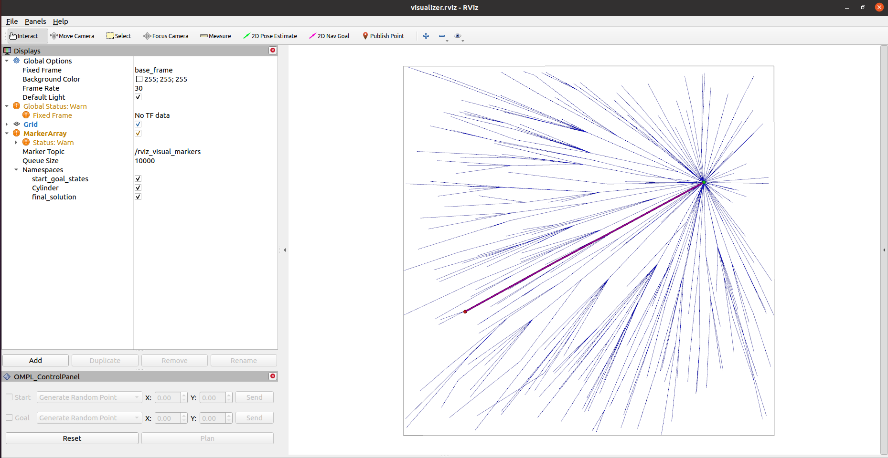
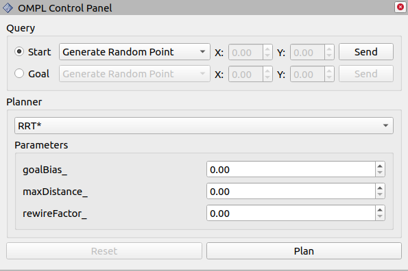

# OMPL 2D Rviz Visualizer

Visualizing, animating and debugging Open Motion Planning Library (OMPL) algorithms in ROS Rviz. Current version of the package only allows to find paths in R^2 state space with path minimizing objectives. More state spaces and different objective functions will be added in the future versions. We also added rviz panel plugin to interface with OMPL (This is currently an ongoing work).



## Installation

### Build from source

Clone this package into your src folder of catkin_workspace:
```
cd <yr_catkin_ws>/src
git clone https://github.com/mlsdpk/ompl_2d_rviz_visualizer.git
```

Install necessary dependencies by running the following command in the root of your workspace:
```
cd ..
rosdep install -y --from-paths src --ignore-src --rosdistro <YOUR_ROS_DISTRO>
```

Then compile with catkin:
```
catkin_make
```

## Rviz Control Panel for interfacing with OMPL

