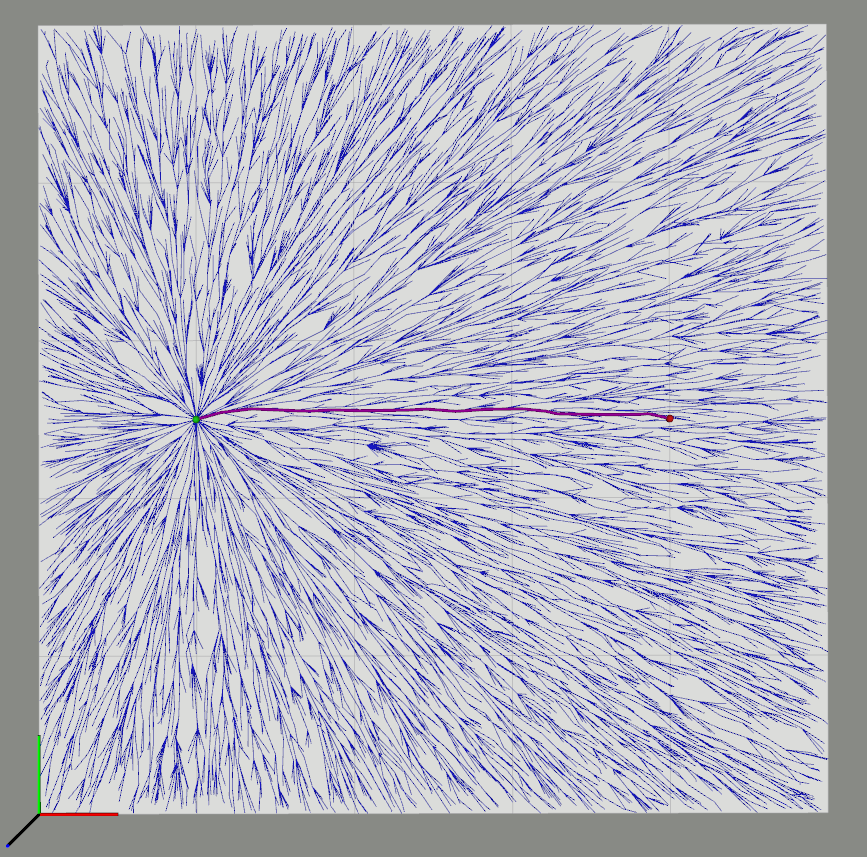
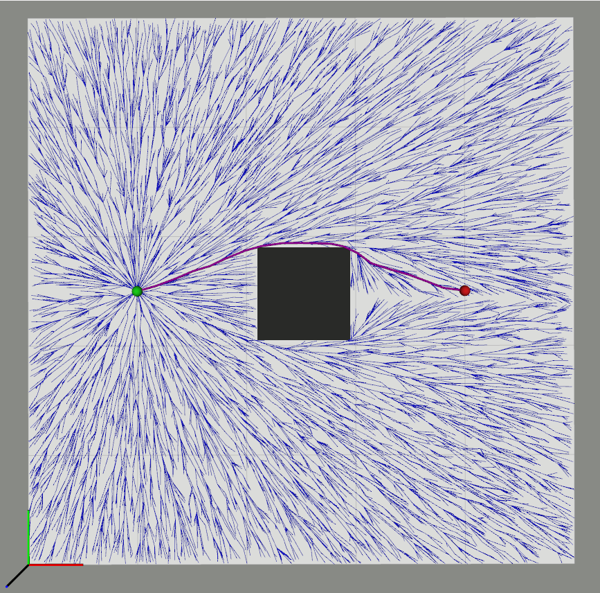
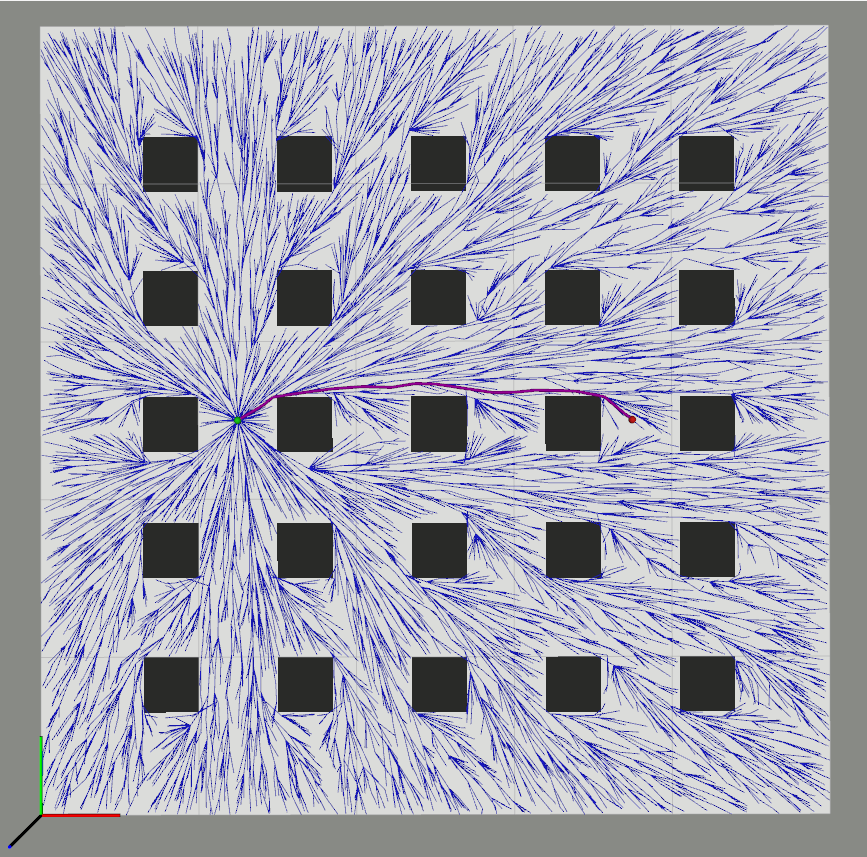
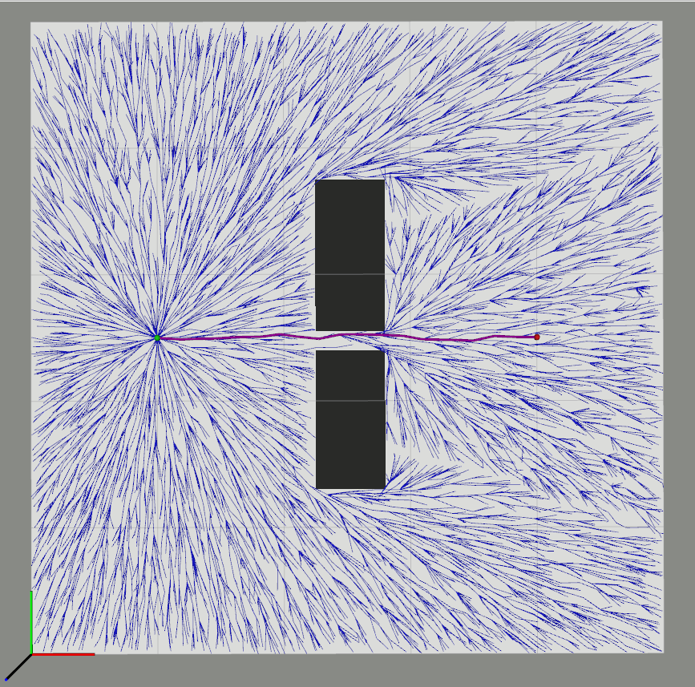
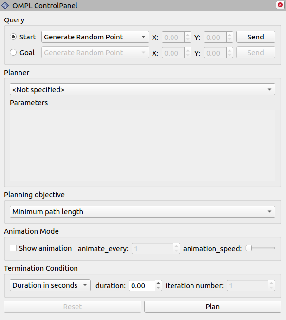
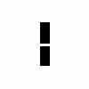

# OMPL 2D Rviz Visualizer

Visualizing, animating and debugging Open Motion Planning Library (OMPL) algorithms in ROS Rviz. The package allows OMPL planners to find paths in R^2 state space with path minimizing objectives and utilizes the occupancy grid maps for collision checking. We have also added a rviz panel plugin to interface with OMPL.

<p float="left">
  
   
  
  
</p>


## Installation

### Build from source

Clone this package into your src folder of catkin_workspace:
```
cd <yr_catkin_ws>/src
git clone https://github.com/mlsdpk/ompl_2d_rviz_visualizer.git
```

Install necessary dependencies by running the following command in the root of your workspace:
```
cd ..
rosdep install -y --from-paths src --ignore-src --rosdistro <YOUR_ROS_DISTRO>
```

Then compile with catkin:
```
catkin_make
```

## Rviz Control Panel for interfacing with OMPL

We provide an easy-to-use rviz panel plugin for interfacing with OMPL.



## Maps

Several occupancy grid maps are specifically chosen for testing OMPL planners, which can be found in most sampling-based planning literatures. In order to select a map, user has to manually provide the name of the map to the `map_name` argument in the [launch file](https://github.com/mlsdpk/ompl_2d_rviz_visualizer/blob/master/ompl_2d_rviz_visualizer_ros/launch/visualizer.launch). Current version of the visualizer provides four different maps:
1. empty_map
2. map_with_single_cube
3. map_with_many_homotopy_classes
4. map_with_single_narrow_passage_gap

1  | 2 | 3 | 4             
:-:|:-:|:-:|:-:
|||
